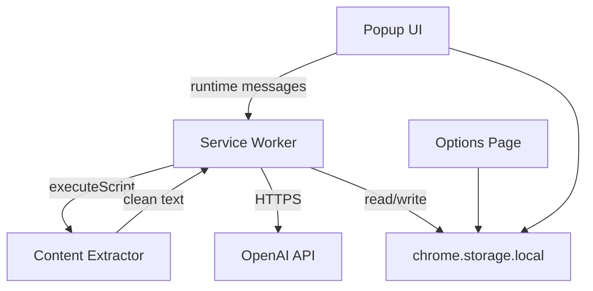

# QuickDigest AI

QuickDigest AI is a production-ready Chrome Extension (Manifest V3) that summarizes any article-like webpage using OpenAI. It delivers a polished popup experience with key takeaways, action items, reading-time estimates, clipboard copy, local history, and a full settings page.

## Features

- One-click summarization of the active tab
- Intelligent content extraction (article/main prioritization, noise removal)
- OpenAI-powered output:
  - Quick summary
  - Key takeaways
  - Action items
  - Reading time estimate
- Premium Apple-inspired UI with dark mode
- Skeleton loading states and toast notifications
- Copy-to-clipboard for each section
- Local summary history (max 20 items)
- Settings page for API key, theme, and history management
- Robust error handling (invalid key, rate limits, unsupported pages, timeouts, retries)

## Tech stack

- Chrome Manifest V3
- Vanilla HTML, CSS, JavaScript (ES modules)
- Service worker background architecture
- `chrome.storage.local` for settings and history

## Project structure

```text
Chrome-Extension-Project/
├── manifest.json
├── docs/
│   └── privacy-policy.md
└── src/
    ├── assets/icons/
    ├── background/service-worker.js
    ├── content/extractor.js
    ├── options/
    ├── popup/
    ├── styles/
    └── utils/
```

## Installation (unpacked)

1. Clone this repository:

   ```bash
   git clone https://github.com/maco-cloud/Chrome-Extension-Project.git
   cd Chrome-Extension-Project
   ```

2. Open Chrome and go to `chrome://extensions`
3. Enable **Developer mode**
4. Click **Load unpacked**
5. Select the repository root folder (the folder containing `manifest.json`)

## Configure OpenAI API key

1. Create an API key at [platform.openai.com/api-keys](https://platform.openai.com/api-keys)
2. Click the QuickDigest AI extension icon
3. Open **Settings** (gear icon)
4. Paste your API key and click **Save API key**

Your key is stored locally via `chrome.storage.local` and never sent anywhere except OpenAI.

## Usage

1. Navigate to an article, blog post, or content-rich webpage
2. Click the QuickDigest AI extension icon
3. Press **Summarize this page**
4. Review summary cards and copy any section
5. Reopen recent summaries from the history list

## Architecture



- **Popup (`src/popup`)**: UI, loading states, rendering, clipboard, history display
- **Service worker (`src/background`)**: Orchestrates extraction, OpenAI calls, persistence
- **Content script (`src/content/extractor.js`)**: DOM extraction executed on demand
- **Utils (`src/utils`)**: API client, storage helpers, constants, URL guards

## Permissions rationale

- `activeTab` + `scripting`: least-privilege access to extract content only when you invoke the extension
- `storage`: save API key, theme, and history locally
- `https://api.openai.com/*`: required for summarization requests

## Publishing to Chrome Web Store

1. Test thoroughly in Developer Mode
2. Zip the project root (include `manifest.json`, `src/`, `docs/`, `README.md`; exclude `.git/`)
3. Register a [Chrome Web Store developer account](https://chrome.google.com/webstore/devconsole)
4. Upload the ZIP as a new item
5. Provide:
   - Store description and screenshots
   - Privacy policy URL (host `docs/privacy-policy.md` on GitHub Pages or your website)
   - Permission justifications matching this README

## Troubleshooting

| Issue | Solution |
|-------|----------|
| "OpenAI API key is missing" | Add your key in Settings |
| "Invalid OpenAI API key" | Regenerate key and save again |
| "Not enough readable content" | Use a content-rich article page |
| "This page cannot be summarized" | Avoid `chrome://`, Web Store, or browser internal pages |
| Rate limit errors | Wait briefly and retry |
| Clipboard copy fails | Grant clipboard permission when prompted |

## Security notes

- Never commit your API key to git
- Use restricted OpenAI keys where possible
- Review OpenAI usage and billing regularly

## License

This project is provided as-is for development and publishing by the repository owner.
