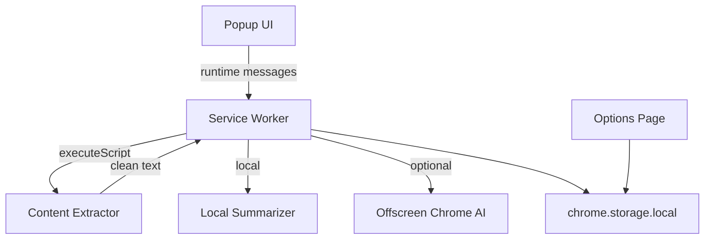

# QuickDigest AI

QuickDigest AI is a free Chrome Extension (Manifest V3) that summarizes article-like webpages **without sign-in, API keys, or paid services**. It works for everyone using on-device processing, with optional Chrome built-in AI when your browser supports it.

## Features

- One-click summarization of the active tab
- **No account, no credit card, no API key**
- Intelligent content extraction (article/main prioritization, noise removal)
- Output sections:
  - Quick summary
  - Key takeaways
  - Action items
  - Reading time estimate
- Summary engines:
  - **Local (default fallback):** fast extractive summarization, works everywhere
  - **Chrome on-device AI (optional):** uses Chrome Summarizer API when available
  - **Auto:** tries Chrome AI first, falls back to local instantly
- Premium Apple-inspired UI with dark mode
- Copy-to-clipboard, local history, settings page

## Tech stack

- Chrome Manifest V3
- Vanilla HTML, CSS, JavaScript (ES modules)
- Service worker + optional offscreen document for Chrome AI
- `chrome.storage.local` for settings and history

## Project structure

```text
Chrome-Extension-Project/
├── manifest.json
├── docs/privacy-policy.md
└── src/
    ├── assets/icons/
    ├── background/          service-worker.js, offscreen AI worker
    ├── content/extractor.js
    ├── options/
    ├── popup/
    ├── styles/
    └── utils/
        ├── local-summarizer.js
        ├── chrome-ai.js
        └── summarizer.js
```

## Installation (unpacked)

1. Clone the repository:

   ```bash
   git clone https://github.com/maco-cloud/Chrome-Extension-Project.git
   cd Chrome-Extension-Project
   ```

2. Open Chrome → `chrome://extensions`
3. Enable **Developer mode**
4. Click **Load unpacked**
5. Select the repository root (folder containing `manifest.json`)

## Usage

1. Open an article or blog post
2. Click the QuickDigest AI icon
3. Press **Summarize this page**
4. Review summary cards and copy any section

No setup required. Optional: open **Settings** to choose summary engine or enable dark mode.

## Summary engines explained

| Engine | Description |
|--------|-------------|
| **Auto** | Best experience: Chrome on-device AI when available, otherwise local |
| **Local** | Always works; free algorithmic summarization on your device |
| **Chrome on-device AI** | Uses Chrome built-in Summarizer API (Chrome 138+, device/browser dependent) |

## Architecture



## Permissions rationale

- `activeTab` + `scripting`: extract content only when you invoke the extension
- `storage`: save theme, engine preference, and history locally
- `offscreen`: run Chrome on-device summarizer when supported

No external API host permissions are required.

## Publishing to Chrome Web Store

1. Test on article pages in Developer Mode
2. Zip the project root (include `manifest.json`, `src/`, `docs/`; exclude `.git/`)
3. Upload via [Chrome Web Store Developer Dashboard](https://chrome.google.com/webstore/devconsole)
4. Provide privacy policy URL (host `docs/privacy-policy.md`)
5. Explain permissions: on-device summarization only, no remote API

## Troubleshooting

| Issue | Solution |
|-------|----------|
| "Not enough readable content" | Use a text-rich article page |
| "This page cannot be summarized" | Avoid `chrome://`, PDF, or internal browser pages |
| Chrome AI not available | Use **Auto** or **Local** engine in Settings (local always works) |
| Summaries feel basic | Expected on **Local** engine; enable Chrome AI if your browser supports it |
| Clipboard copy fails | Grant clipboard permission when prompted |

## License

Provided as-is for development and publishing by the repository owner.
